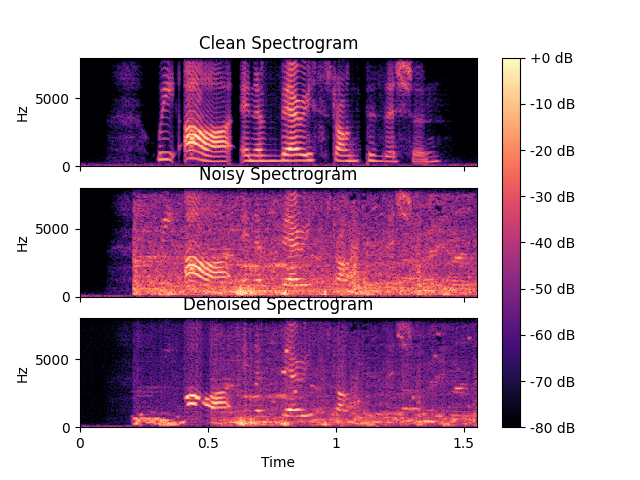

[![LinkedIn][linkedin-shield]][linkedin-url]

<!-- PROJECT LOGO -->
 

  

  

    Audio Denoiser
     
  

<!-- ABOUT THE PROJECT! -->
## About The Project

This is an implementation of <a href="https://arxiv.org/pdf/1609.07132.pdf">A Fully Convolutional Neural Network for Speech Enhancement</a>. This research paper presents a method for speech enhancement that can be used in hearing aids. The model I trained in this repo was also used in a web app for speech enhancement in my senior design class and you can see that <a href="https://github.com/jrhaxton/JayHear">here</a>.

<!-- RESULTS! -->
## Results

<!-- BUILT WITH! -->
## Built With

<a href="https://librosa.org/doc/main/index.html">
    
        
 </a>
 
 
 <a href="https://numpy.org/doc/stable/index.html#">
    
        
 </a>
      
  <a href="https://pytorch.org/">
    
        
 </a>

## Acknowledgements
* [Sthalles](https://sthalles.github.io/practical-deep-learning-audio-denoising/#:~:text=Introduction,degrading%20the%20signal%20of%20interest.&text=In%20this%20situation%2C%20a%20speech,to%20improve%20the%20speech%20signal.)
* [othneildrew github](https://github.com/othneildrew)

<!-- MARKDOWN LINKS & IMAGES -->
<!-- https://www.markdownguide.org/basic-syntax/#reference-style-links -->
[contributors-shield]: https://img.shields.io/github/contributors/othneildrew/Best-README-Template.svg?style=for-the-badge
[contributors-url]: https://github.com/othneildrew/Best-README-Template/graphs/contributors
[forks-shield]: https://img.shields.io/github/forks/othneildrew/Best-README-Template.svg?style=for-the-badge
[forks-url]: https://github.com/othneildrew/Best-README-Template/network/members
[stars-shield]: https://img.shields.io/github/stars/othneildrew/Best-README-Template.svg?style=for-the-badge
[stars-url]: https://github.com/othneildrew/Best-README-Template/stargazers
[issues-shield]: https://img.shields.io/github/issues/othneildrew/Best-README-Template.svg?style=for-the-badge
[issues-url]: https://github.com/othneildrew/Best-README-Template/issues
[license-shield]: https://img.shields.io/github/license/othneildrew/Best-README-Template.svg?style=for-the-badge
[license-url]: https://github.com/othneildrew/Best-README-Template/blob/master/LICENSE.txt
[linkedin-shield]: https://img.shields.io/badge/-LinkedIn-black.svg?style=for-the-badge&logo=linkedin&colorB=555
[linkedin-url]: https://www.linkedin.com/in/braden-lockwood-b7606a1b5/
[product-screenshot]: images/screenshot.png
